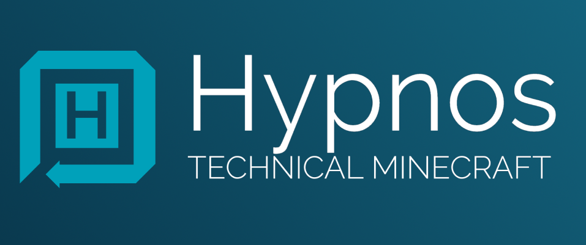

<h3 align="center">
	</img>
	<br>
	Hypnos Core
	<br>
</h3>

<p align="center">session manager written in rust 🚀</p>

<p align="center">
	<a href="./LICENSE"></a>
</p>

Hypnos Core is an attempt to create a server managment tool in the form of a discord bot, it has many features geared towards Minecraft, however, it is very flexible and can be adapted for any game server using a command line interface.

The bot is called a session manager, this is because the bot interfaces with tmux sessions to do a lot of it's work, this allows it greater flexibility than most bots. It can execute anything a user would normally execute.

I was unhappy with the other chat bots that existed for Minecraft, so I decided to make my own using a much more flexible and versatile idea.

This code was made to run on my server, and I obviously cannot ensure that it will function as intended for anyone else. This code is very messy, if you have any pointers for improvement please let me know.

#### installation

This is not inteded for anyone else to use in it's current state

if you still wish to mess around with it, it is recommended you have [cargo](https://doc.rust-lang.org/cargo/getting-started/installation.html) installed

ensure that you have `tar`, `tmux`, and `git`, this was only tested on linux, however, any *nix based system should support it, and wsl2 for windows should also function fine. 

```
$ mkdir -p hypnos_core/build
$ cd hypnos_core/build
$ git clone git@github.com:NotCreative21/hypnos_core.git
$ cd hypnos_core
$ cargo build --release
$ cp target/release/hypnos_core ../..
$ ./hypnos_core reset-cfg
```

After these steps, the environment is setup for the recompile command to work and the hypnos_core.conf file can now be filled out.

#### current features
* self-recompiling, can recieve upstream updates and recompile itself
* unified chat bridge between minecraft, discord, and other games
* async code base
* execute in-game commands, shell commands, etc, via discord
* in-game math eval, example: `=4*4` will return `-> 16`
* server monitor, checks server health and warns if there are issues
* backup manager, create, delete, and list backups from discord
* backup scheduler, create backups on intervals

#### currently under development
* improving reliable recompiling
* region backup system, save/load backups
* map render scheduler

#### future features
* chest searcher per a region
* scoreboard comparison from two different dates
* discord auto mod/ban features
* copies of itself can communicate without discord via tcp streams
